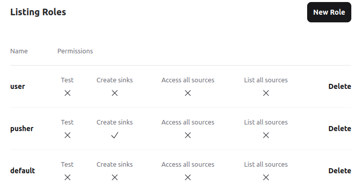

# Changelog for Cocktailparty v0.2 ( Stream distribution Beta)

Welcome to the latest update of Cocktailparty! We're excited to bring you several new features and improvements in this release. Here's what's new in version 0.2:

### Enhanced Stream Distribution
- **Multiple Redis Instances**: Cocktailparty now supports using several Redis instances, enhancing scalability and performance.
- **Roles and Permissions System**: Administrators can now create roles and assign permissions for greater flexibility in user management.
  
- **Public Sources**: Sources can now be marked as `public`, allowing all users to fetch data without needing to subscribe first.

### Introducing Sinks
- **Sink Channels**: Introduction of `sinks` – Redis channels where users can push data (more details coming in the next release).

### User Experience and Interface Improvements
- **Source Previews**: Display a sample of the latest 5 messages from each `source`, allowing users to preview content before subscribing.
- **Connection Indicator**: Addition of a Redis-instance connection indicator to provide real-time connectivity status.
- **Log Formatting**: Improved log formatting for better readability and troubleshooting.
- **IPv6 Support**: Full IPv6 support for modern networking compatibility.

### Role Management and Security
- **Default Role for New Users**: New users are automatically assigned to the `default` role, which allows access to public `sources` only.
- **Mass Subscription Management**: Admins can now subscribe and unsubscribe users in bulk, simplifying user management.

### Developer Tools and Features
- **Enhanced Flag and Dashboard Features**: `FunWithFlags` and the Phoenix Dashboard are now active in production. Additionally, Mailbox Preview is enabled in the development environment.

Thank you for your continued support, and we hope you enjoy these new features in Cocktailparty! Your feedback is invaluable as we strive to improve and expand our service.

# v0.1 (2023-06-16)

## Initial poc release

Cocktailparty inital features:

- subscribe to pubsub redis topics into "sources"
- allow users to subscribe to "sources"
- broadcast subscribed pubsub topics to users over websocket
- basic CRUD for sources / users
- user authentication, authorization, creation, and self-registration
- user presence indicators on websocket connections
- seperate broker / webserver nodes to avoid downtime on deploy